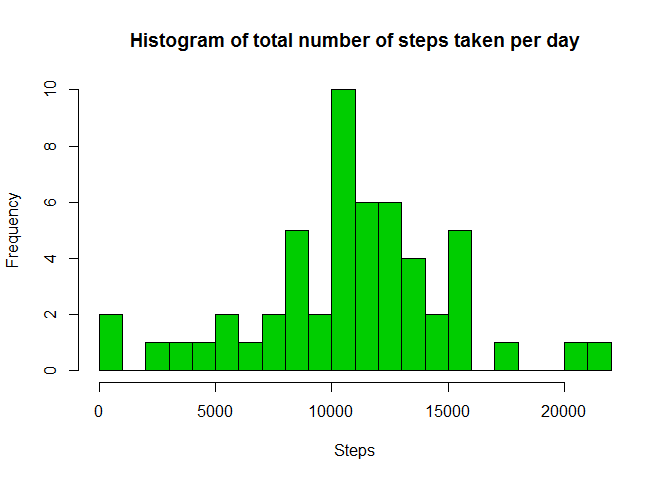
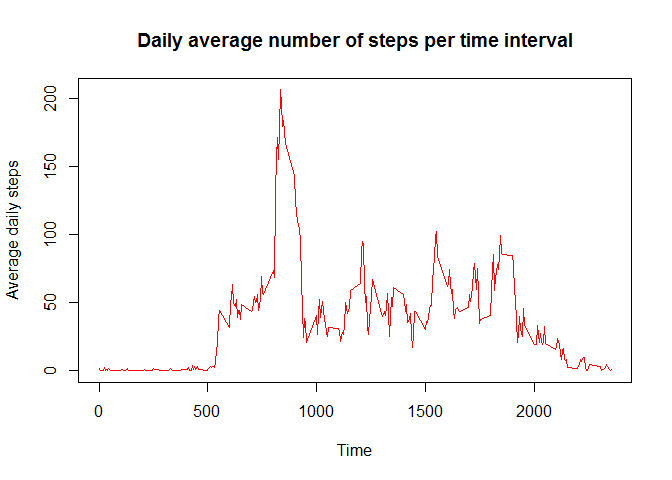
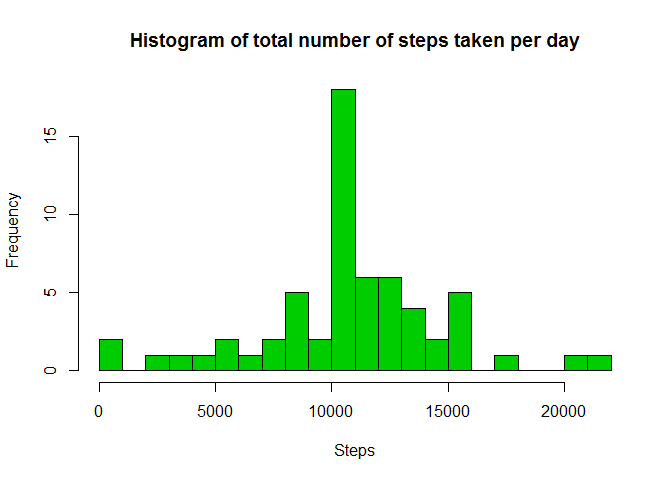
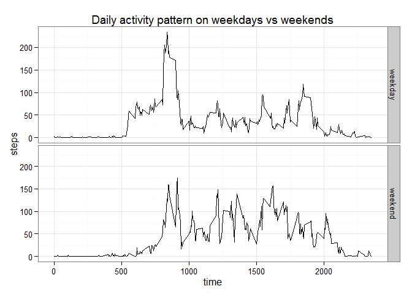

# Reproducible Research: Peer Assessment 1


## Loading and preprocessing the data


```r
## Unzip the dowloaded data and load it into RStudio
unzip("repdata-data-activity.zip")
activity<- read.csv("activity.csv")
## Convert the Date column into the appropriate class
activity$date<- as.Date(activity$date, "%Y-%m-%d")
```

## What is mean total number of steps taken per day?

1. First, we summarize the number of steps taken each day using the aggregate function and then plot a histogram

```r
stepsbyday<- aggregate(steps ~ date, activity, sum)
hist(stepsbyday$steps, xlab = "Steps", main = "Histogram of total number of steps taken per day", col = 3, breaks=17)
```

 

2. Next we calculate the mean and the median of the data


```r
mean(stepsbyday$steps)
```

```
## [1] 10766.19
```

```r
median(stepsbyday$steps)
```

```
## [1] 10765
```

## What is the average daily activity pattern?

```r
averageStepsDaily <- aggregate(x = list(steps = activity$steps), 
                               by = list(interval = activity$interval),
                               mean, na.rm = TRUE)
plot(averageStepsDaily$interval, averageStepsDaily$steps, type= "l", col="red",
     xlab="Time", ylab= "Average daily steps", main= "Daily average number of steps per time interval")
```

 

## Which 5-minute interval, on average across all the days in the dataset, contains the maximum number of steps?

```r
averageStepsDaily[which.max(averageStepsDaily$steps),]
```

```
##     interval    steps
## 104      835 206.1698
```

## Imputing missing values

1. Calculate and report the total number of missing values in the dataset (i.e. the total number of rows with NAs)

```r
sum(is.na(activity))
```

```
## [1] 2304
```
2. Replace the NA data with the 5-minute interval average

```r
new_activity<- activity

for (i in 1:nrow(new_activity)) {
        if (is.na(new_activity$steps[i])) {
                new_activity$steps[i]<- averageStepsDaily$steps[which(new_activity$interval[i]==averageStepsDaily$interval)]
        }
}
```
3. Make a histogram of the total number of steps taken each day and Calculate and report the mean and median total number of steps taken per day. Do these values differ from the estimates from the first part of the assignment? What is the impact of imputing missing data on the estimates of the total daily number of steps?

```r
new_stepsbyday <- aggregate(steps ~ date, new_activity, sum)
hist(new_stepsbyday$steps, xlab = "Steps", main = "Histogram of total number of steps taken per day", col = 3, breaks=17)
```

 

```r
mean(new_stepsbyday$steps)
```

```
## [1] 10766.19
```

```r
median(new_stepsbyday$steps)
```

```
## [1] 10766.19
```
The mean and the median in both cases are almost the same which shows that replacing NA values with the average value does not add anything to the data.

## Are there differences in activity patterns between weekdays and weekends?


```r
activity$weekdays <- weekdays(activity$date)
activity$weekdays <- ifelse(activity$weekdays %in% c("Saturday", "Sunday"),"weekend", "weekday")
activity$weekdays <- factor(activity$weekdays)
dailysteps_weekdays <- aggregate(steps ~ interval + weekdays, data = activity, mean)

library(ggplot2)
g<- ggplot(dailysteps_weekdays, aes(interval, steps))
g + geom_line() + facet_grid(weekdays ~ .) + theme_bw() + labs(x = "time") + labs(y = "steps") + labs(title= "Daily activity pattern on weekdays vs weekends")
```

 

